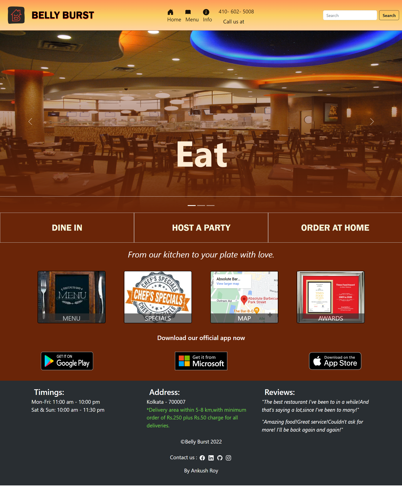
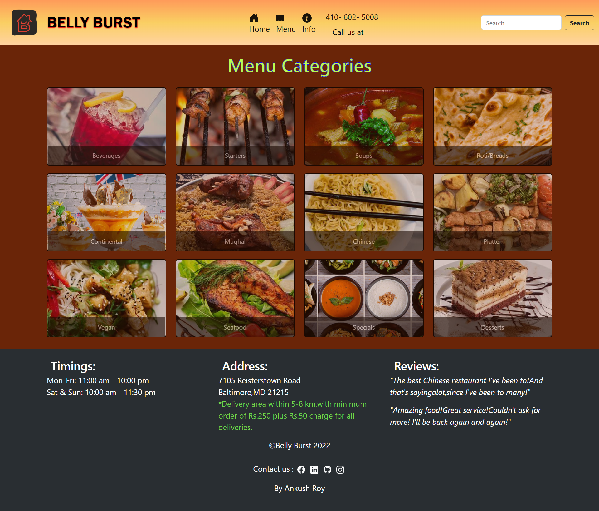
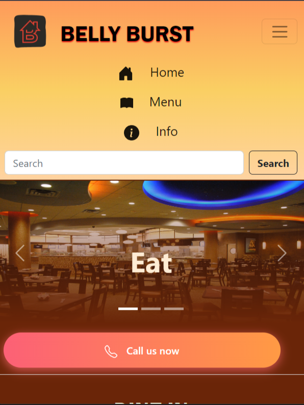

<h4>Belly Burst</h4> is a responsive restaurant website made with HTML, CSS, Bootstrap and Javascript.

<<<<<<< HEAD
<h2>Disclaimer </h2>
=======
<h2>Disclaimer</h2>
>>>>>>> 354ec93b6254470d6902e532d8a0cb494c803de8
This website is not recommended for official use.

<h2>Description </h2>
This only the frontend part of a dummy website created for a restaurant. You can check out the landing page of the restaurant,different menu and special categories, info about the place and also make a call. 

<h2>Author</h2>
Ankush Roy - https://github.com/ankushroy25

<h2>Previews</h2>

<h2>Acknowledgement </h2>
<ul>
    <li>Coursera - HTML, CSS, and Javascript for Web Developers by Yaakov Chaikin<li>
    <li>Youtube - Traversy Media</li>
    <li>Documentations - https://www.w3schools.com/</li>
</ul>

